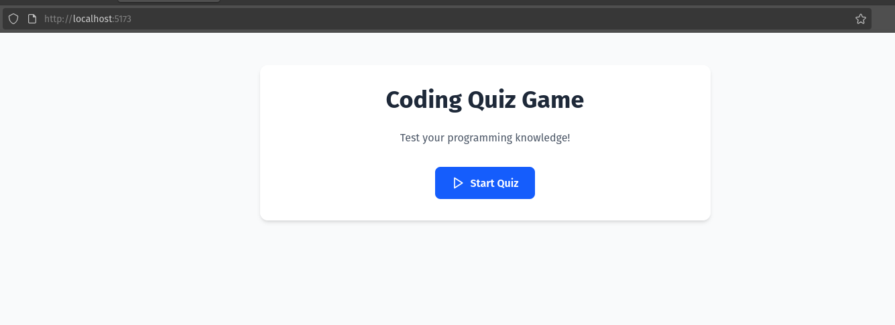
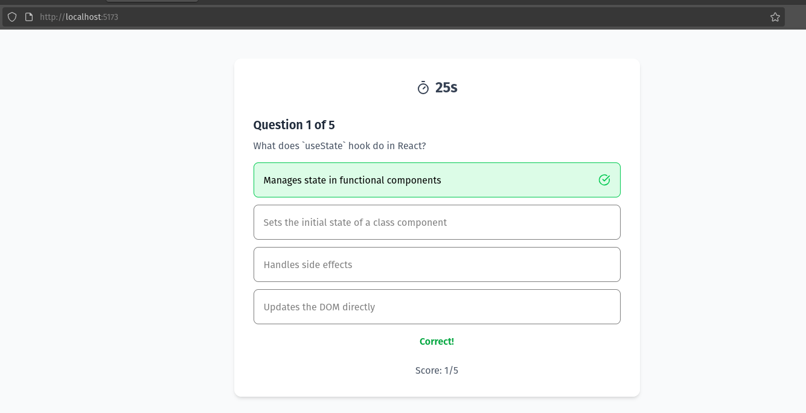
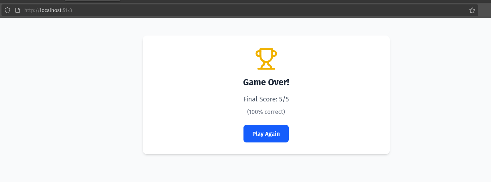
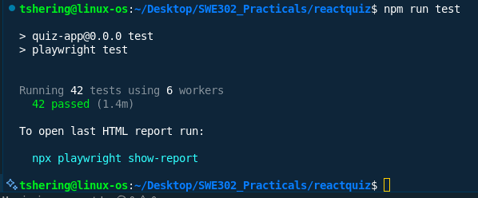
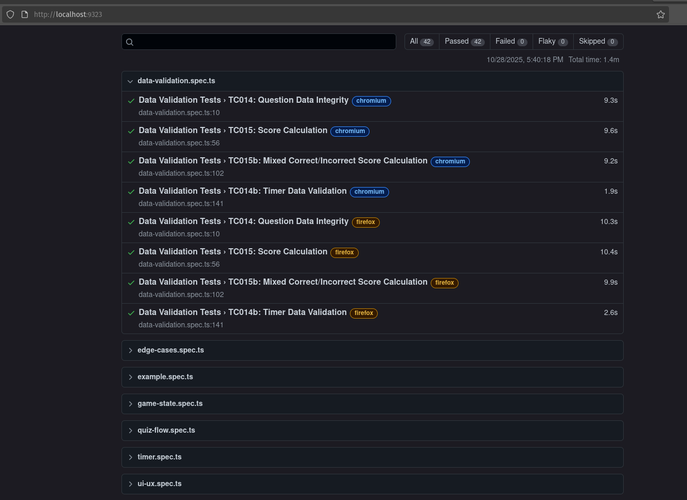

# Practical_01 Report: React Quiz Application

## Overview

This practical focuses on building a simple quiz application using **React**. The goal is to demonstrate fundamental concepts of React such as components, state management, props, and event handling, while also applying basic software testing and quality assurance principles.

**Full working code Repository:** [https://github.com/tsheringphuntsho18/reactquiz](https://github.com/tsheringphuntsho18/reactquiz)

---

## Objectives

- Develop a functional quiz application using React.
- Apply component-based architecture for modularity and reusability.
- Implement state management for quiz logic (questions, answers, scoring).
- Practice basic testing and debugging techniques.

---

## Screenshots

Start Screen
  

Quiz in Progress
  

Score Report 
 

Test Pass  

Playwright report

I didn't test for safari (webkit) since my device is not compatable for it.

---

## Challenges Faced

- Managing state transitions between questions and handling edge cases (e.g., last question).
- Ensuring components re-render correctly on state changes.
- Debugging issues with answer selection and score calculation.
- Making all the test pass.

---

## Conclusion

This practical provided hands-on experience with React fundamentals and reinforced the importance of component-based design and state management. The project also highlighted the need for thorough testing to ensure application reliability.

For full source code and further details, visit the [GitHub repository](https://github.com/tsheringphuntsho18/reactquiz).