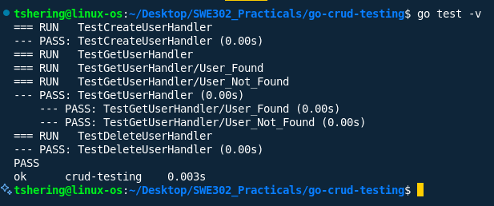
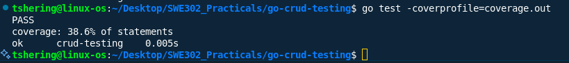
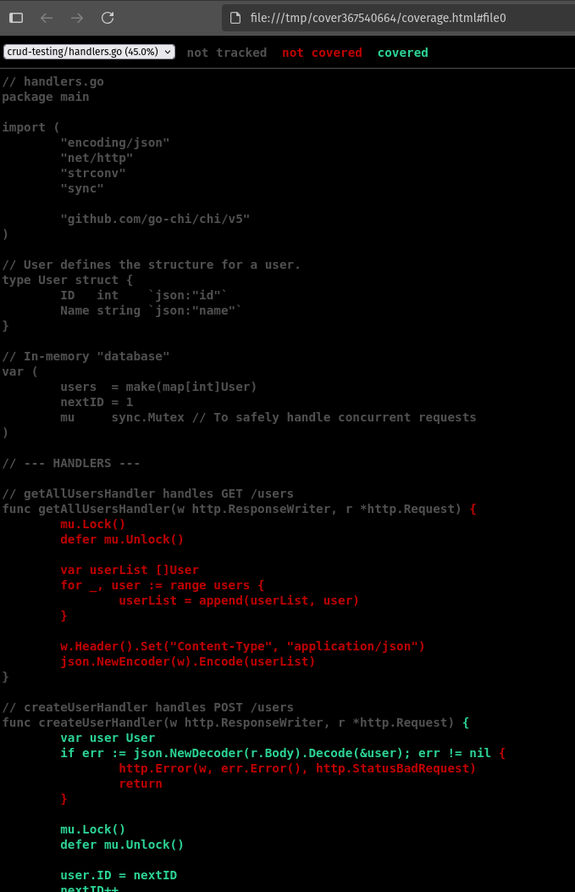
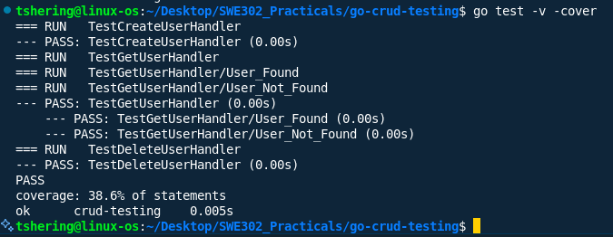

# Practical_02 Report: Go-CRUD Testing

## Overview

The goal of this practical was to build a simple in-memory Users API with CRUD (Create, Read, Update, Delete) operations, write unit tests for each operation to verify correct behavior under various conditions and generate and analyze a code coverage report to ensure robust testing.

**Full working code Repository:** [https://github.com/tsheringphuntsho18/go-crud-testing](https://github.com/tsheringphuntsho18/go-crud-testing)

---

## Results & Screenshots

### a. Terminal Output

### b. Code Coverage Summary

  
This percentage tells you how much of your code was executed during the tests. 100% is ideal, but a high percentage (80%+) is generally a good goal.

### c. Code Coverage HTML UI

  

- Green text means the code was executed by your tests.
- Red text means it was not.
- Grey text means it's not executable code (like comments or declarations).

### d. Project Cover

---

## Conclusion

Through this practical, I learned how to:

- Structure Go projects for testability.
- Write comprehensive unit tests for HTTP handlers.
- Use Go's built-in tools to measure and visualize code coverage.
- Interpret coverage reports to identify untested code paths and improve test quality.

---

