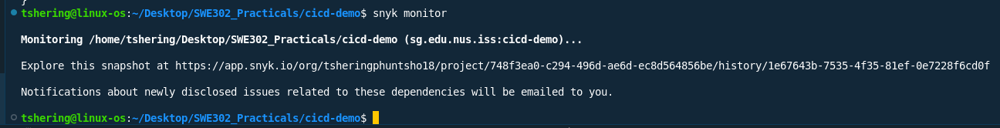

# Practical_04 Report: Setting up SAST with Snyk in GitHub Actions

## Overview

This practical demonstrates setting up SAST(Static Application Security Testing) with snyk in github actions. I have documented the steps taken and outcomes achieved during this Practical, which focused on integrating Static Application Security Testing (SAST) using Snyk within GitHub Actions for a Java Spring Boot project. The goal was to automate security scanning and vulnerability management as part of the CI/CD pipeline.

**Full working code Repository:** https://github.com/tsheringphuntsho18/cicd-demo

```bash
git clone https://github.com/tsheringphuntsho18/cicd-demo.git
cd cicd-demo
mvn clean compile
mvn test
```


Start the application locally  
`mvn spring-boot:run`

**Result**  
  
  


## Hands-on exercises summary

### Exercise 1: Basic Setup

**Objective**: Set up basic Snyk scanning for the project

#### Snyk Account Setup

- Created a Snyk account and connected it to my GitHub account for seamless integration.
- Generated a Snyk API token from the Snyk dashboard.


#### GitHub Secrets Configuration

- Added the Snyk API token as a secret named `SNYK_TOKEN` in the GitHub repository ([cicd-demo](https://github.com/tsheringphuntsho18/cicd-demo)).


### Exercise 2: Enhanced Configuration

**Objective**: Improve the Snyk configuration with additional features

- Enhanced the workflow to:
  - Set severity thresholds for vulnerability reporting.
  - Upload Snyk results in SARIF format to GitHub Security tab.
  - Add monitoring for deployed dependencies.


### Exercise 3: Advanced Configuration and Management

**Objective**: Handle and manage detected vulnerabilities. Implement comprehensive security scanning strategy

- Created a `.snyk` file to ignore specific vulnerabilities as needed.
- Tested the workflow by introducing a vulnerable dependency and verifying Snyk's detection and reporting.
- Updated dependencies to remediate vulnerabilities and confirmed successful scans.


### Exercise 4: Security Dashboard and Reporting

**Objective**: Create comprehensive security reporting and monitoring

For this first we need to install snyk cli and authenticate to snyk account


Execute `snyk monitor` to create a snapshot of your project's dependencies. Snyk will scan it and set up a continuous monitoring service.



Then we will receive the email if any vulnerablity is detected.


Enabled Snyk monitoring for continuous vulnerability tracking. Verified that security scan results appear in the GitHub Security tab.


## Conclusion

This practical provided valuable hands-on experience in integrating Static Application Security Testing (SAST) into a modern CI/CD pipeline using Snyk and GitHub Actions. By automating security scans for every code change, I learned how to identify and remediate vulnerabilities early in the development lifecycle, significantly improving the security posture of the project. The exercises covered the full workflow—from Snyk account setup and secret management to advanced configuration, vulnerability management, and continuous monitoring.

Through this process, I gained practical skills in:

- Setting up and configuring Snyk for Java/Maven projects
- Managing secrets and secure tokens in GitHub
- Enhancing CI/CD workflows for automated security
- Interpreting vulnerability reports and taking remediation actions
- Leveraging dashboards and notifications for ongoing security awareness

Overall, this practical reinforced the importance of integrating security into DevOps practices and demonstrated how developer-friendly tools like Snyk can make security a seamless part of the software delivery process.
