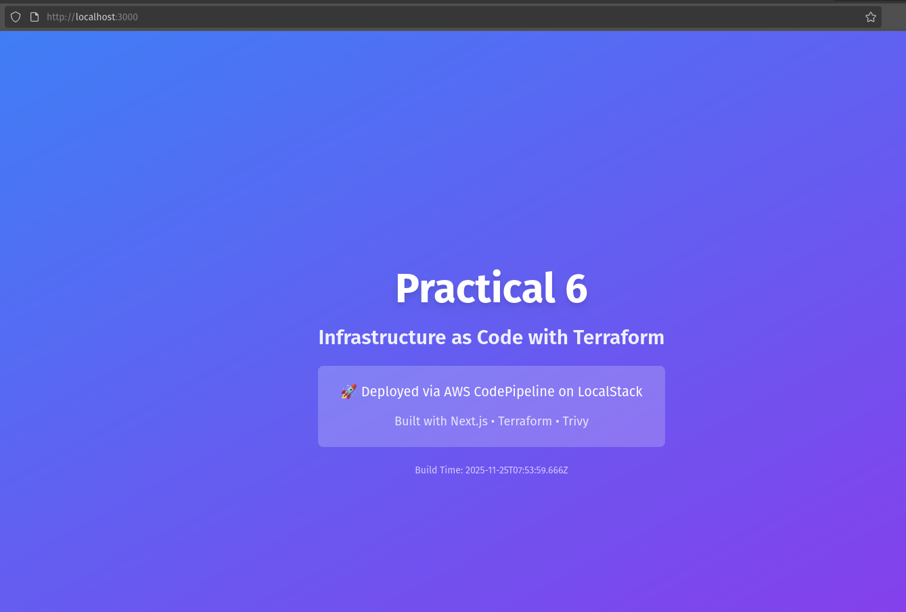
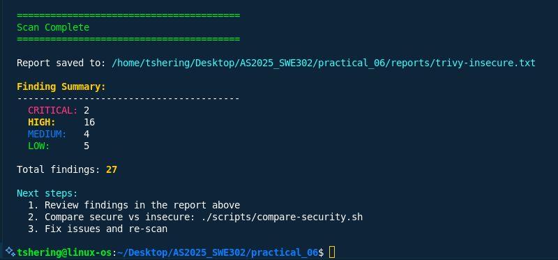
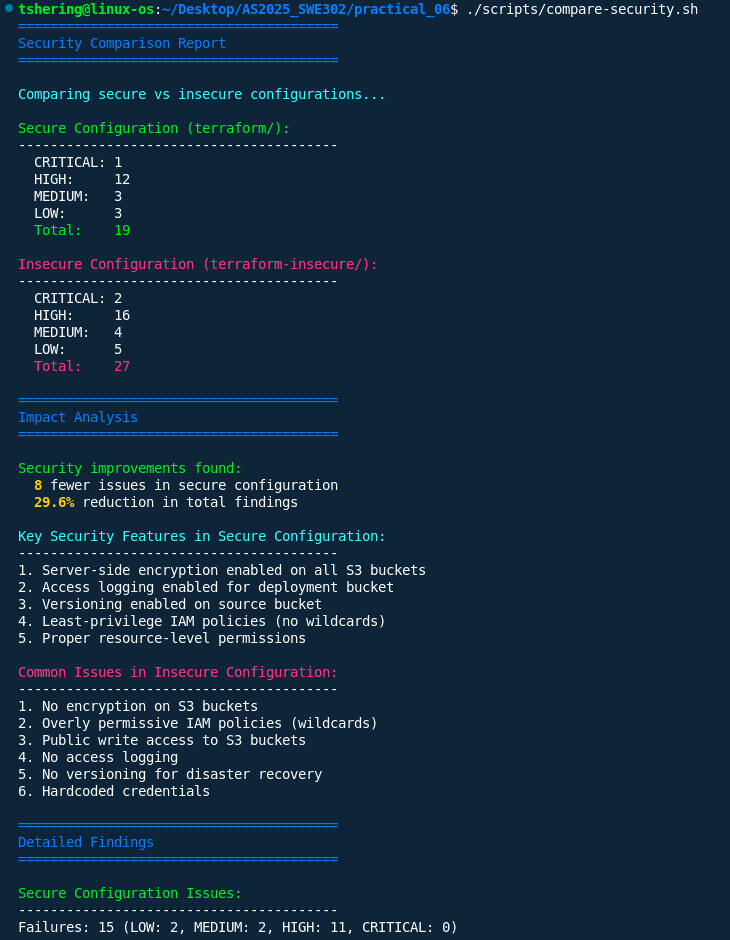

# Practical_06 Report: Infrastructure as Code with Terraform and LocalStack

## Overview
This practical demonstrates how to define, deploy, and secure cloud infrastructure using Infrastructure as Code (IaC). The exercise covers provisioning AWS S3 buckets locally via LocalStack using Terraform, deploying a Next.js static website, and scanning infrastructure code for security vulnerabilities with Trivy.

## Learning Outcomes
- Use Terraform to define and provision infrastructure on LocalStack AWS.
- Deploy a Next.js static website to AWS S3 using IaC.
- Use Trivy to scan Infrastructure as Code for security vulnerabilities.

## Technologies Used
- **Terraform**: Infrastructure as Code tool for defining cloud resources.
- **LocalStack**: Local AWS cloud emulator.
- **AWS S3**: Object storage and static website hosting.
- **Next.js**: React framework for static site generation.
- **Trivy**: Security scanner for IaC and containers.

## Prerequisites
- Docker & Docker Compose
- Terraform (>= 1.0)
- terraform-local (`tflocal`)
- Node.js (>= 18)
- AWS CLI & `awslocal`
- Trivy
- Visual Studio Code (recommended)

Verify installation with:
```sh
docker --version
docker-compose --version
terraform --version
tflocal --version
node --version
npm --version
aws --version
awslocal --version
trivy --version
```

## Quick Start

### Manual Steps
```sh
./scripts/setup.sh
cd nextjs-app && npm ci && npm run build && cd ..
cd terraform && tflocal init && tflocal apply && cd ..
awslocal s3 sync nextjs-app/out/ s3://$(cd terraform && terraform output -raw deployment_bucket_name)/ --delete
./scripts/status.sh
```

## Screenshots
**1. Deployed Website Homepage** 

*This screenshot displays the homepage of the deployed Next.js static website, confirming that the deployment to the S3 bucket was successful and the site is accessible via the configured endpoint.*

**2. Trivy Scan Results (Secure Configuration)**
  
*This screenshot shows the results of running Trivy on the secure Terraform configuration. It highlights that there are no critical or high vulnerabilities detected, indicating best security practices are in place.*

**3. Trivy Scan Results (Insecure Configuration)**  
  
*This screenshot presents the Trivy scan output for the intentionally insecure Terraform configuration. It reveals multiple critical and high vulnerabilities, such as lack of encryption and overly permissive IAM policies, which should be addressed.*

**4. Terraform Apply and Security Comparison** 
  
*This screenshot shows the output of a successful `terraform apply` and a comparison of security scan results between secure and insecure configurations using Trivy. It demonstrates that the secure configuration has no critical or high vulnerabilities, while the insecure configuration does.*

## Terraform Configuration Highlights
- **Provider**: Configured for LocalStack endpoints and test credentials.
- **S3 Deployment Bucket**: Website hosting, public read, server-side encryption (AES256).
- **S3 Logs Bucket**: Stores access logs, encrypted.
- **Bucket Policies**: Explicit public read for website, logging enabled.

## Security Scanning with Trivy

### Scan Secure Configuration
```sh
./scripts/scan.sh terraform
```

### Scan Insecure Configuration
```sh
./scripts/scan.sh insecure
```

### Compare Results
```sh
./scripts/compare-security.sh
```

## Reflection
**Why is it important to scan IaC for security issues?**  
Scanning IaC ensures that infrastructure is provisioned securely, preventing misconfigurations that could lead to data breaches or service disruptions.

**How does LocalStack help in the development workflow?**  
LocalStack enables rapid, cost-effective local testing of AWS infrastructure, allowing developers to validate changes before deploying to real cloud environments.

## Key Takeaways
- IaC makes infrastructure reproducible and version-controlled.
- Security should be integrated from the start.
- Automated scanning catches issues early.
- LocalStack enables local development without cloud costs.
- Terraform provides a consistent way to manage