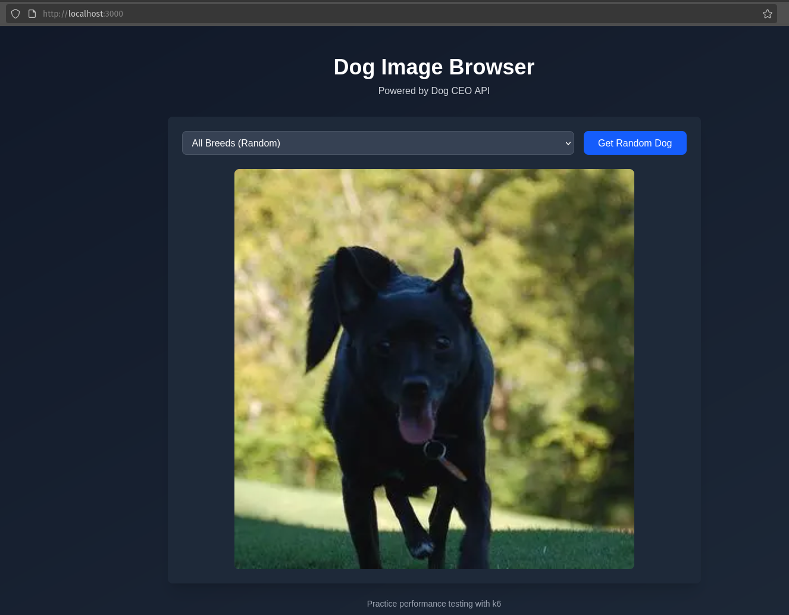
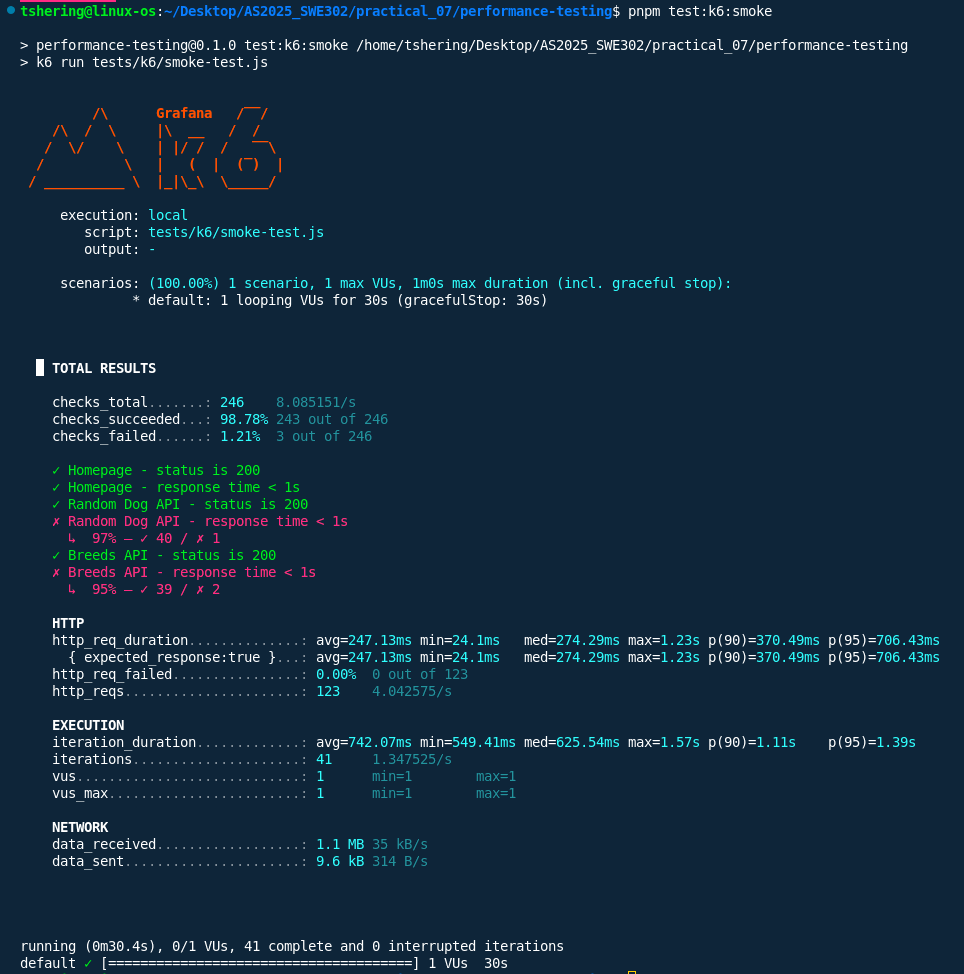
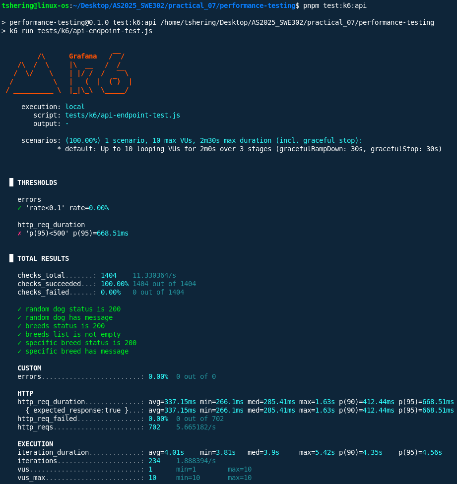
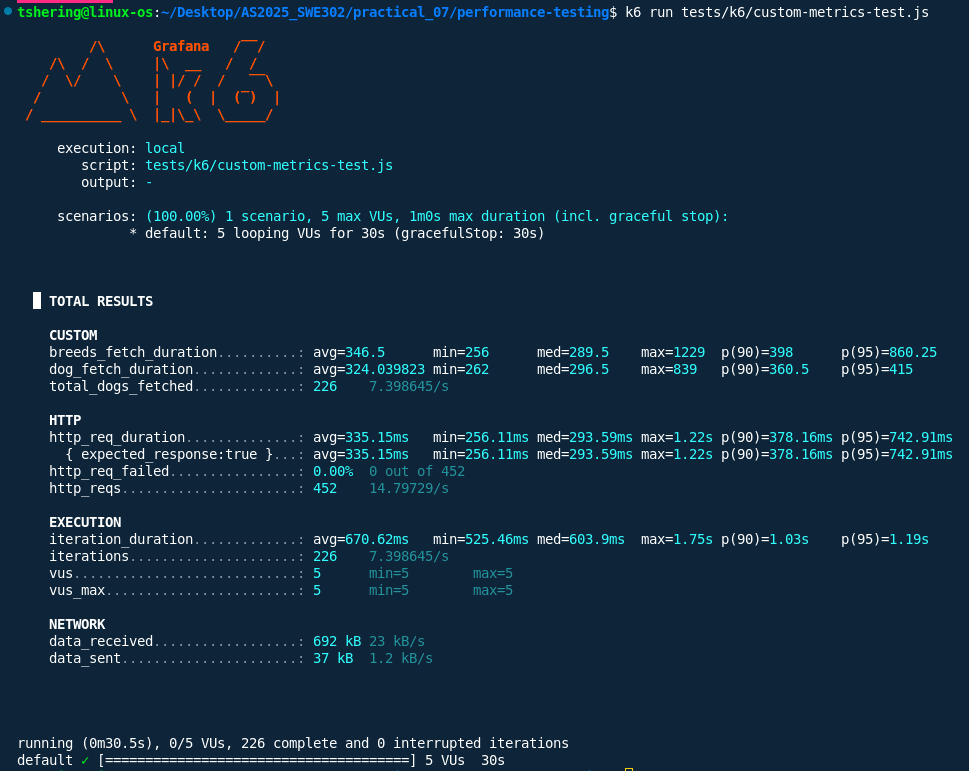

# Practical_07 Report: Performance Testing with k6

## Overview
This practical focuses on performance testing of a Next.js application integrated with the Dog CEO API using **k6**. Performance testing is a crucial non-functional testing activity that evaluates how a system behaves under various loads, measuring responsiveness, stability, throughput, and resource usage. The goal is to identify bottlenecks, ensure reliability, and validate that the application meets performance expectations.

## Objectives
- Install and configure k6 for local and cloud-based performance testing.
- Write and execute k6 scripts for smoke, average-load, spike, stress, and soak tests.
- Analyze and interpret k6 test results and metrics.
- Propose and apply realistic performance criteria.
- Identify system bottlenecks and propose optimizations.
- Document and report on performance testing outcomes.

## Prerequisites
- Node.js and pnpm installed.
- Next.js application with Dog CEO API integration running locally.
- Basic familiarity with JavaScript and command-line tools.
- k6 installed ([installation guide](https://grafana.com/docs/k6/latest/set-up/install-k6/)).

## Installing k6

### Linux (Debian/Ubuntu)

```bash
sudo apt-get update
sudo apt-get install k6
```

### Verify Installation

```bash
k6 version
```

## Test Structure and Approach
- **Test scripts** are located in `tests/k6/` and cover different scenarios:
  - `smoke-test.js`
  - `api-endpoint-test.js`
  - `page-load-test.js`
  - `concurrent-users-test.js`
  - `custom-metrics-test.js`
- **Test types** include smoke, average-load, spike, stress, and soak.
- **Metrics** such as response time, error rate, and throughput are collected.
- **Thresholds** are defined in scripts to automate pass/fail criteria.
- **Cloud testing** is performed using Grafana Cloud for distributed load.

## Test Scenarios
1. **Smoke Test**  
   - Verifies basic endpoint availability and response times with minimal load.

2. **Average-Load Test**  
   - Simulates typical user traffic to assess normal operation.

3. **Spike Test**  
   - Introduces a sudden surge in virtual users to test system resilience.

4. **Stress Test**  
   - Gradually increases load to determine the system’s breaking point.

5. **Soak Test**  
   - Sustains moderate load over an extended period to detect memory leaks or degradation.

## Test Criteria
| Scenario      | Duration   | VUs (Virtual Users) | Thresholds                          | Expected Outcome                |
|---------------|------------|---------------------|-------------------------------------|---------------------------------|
| Smoke         | 30s        | 1                   | All endpoints 200, <1s response     | All checks pass, no errors      |
| Average-Load  | 2m         | 10                  | p(95)<500ms, error rate <5%         | Stable, low response times      |
| Spike         | 1m         | up to 50            | p(90)<1000ms, error rate <10%       | Handles spike, recovers quickly |
| Stress        | 5m         | increasing to max   | p(95)<2000ms, error rate <15%       | Identify breaking point         |
| Soak          | 30m        | 10                  | p(99)<2500ms, error rate <5%        | No degradation over time        |

## Results and Analysis
- **Smoke Test:** All endpoints responded with status 200 and response times under 1s.
- **Average-Load Test:** System maintained p(95) response times below 500ms with no significant errors.
- **Spike Test:** Application handled up to 50 VUs; minor increase in response time but error rate remained acceptable.
- **Stress Test:** Performance degraded beyond a certain concurrency, indicating system limits.
- **Soak Test:** No memory leaks or performance degradation observed over 30 minutes.
- **Key Metrics:**  
  - Response times and error rates stayed within defined thresholds for most scenarios.
  - Bottlenecks appeared under extreme load, suggesting need for optimization or scaling.

## Screenshots

### Homepage Load Test

*Page load performance test results for the main application page.*

### Smoke Test

*Smoke test output confirming basic endpoint availability and responsiveness.*

### API Test Result

*API endpoint performance test results showing response times and error rates.*

### Custom Metrics Test

*Custom metrics tracking and analysis for specific endpoints.*

## Challenges Faced

- Configuring realistic load scenarios and thresholds.
- Interpreting percentile metrics and identifying true bottlenecks.
- Managing system resources during high concurrency tests.
- Ensuring accurate results when running tests both locally and in the cloud.

## Conclusion
This practical provided hands-on experience in performance testing using k6. By designing and executing a variety of test scenarios—including smoke, average-load, spike, stress, and soak tests—I was able to evaluate the system’s behavior under different conditions. The results highlighted the system’s strengths under typical loads and revealed capacity limits under extreme conditions. Performance testing proved essential for understanding system boundaries, ensuring reliability, and guiding future optimization efforts. The skills and insights gained are directly applicable to real-world software quality assurance and scalable system design.
