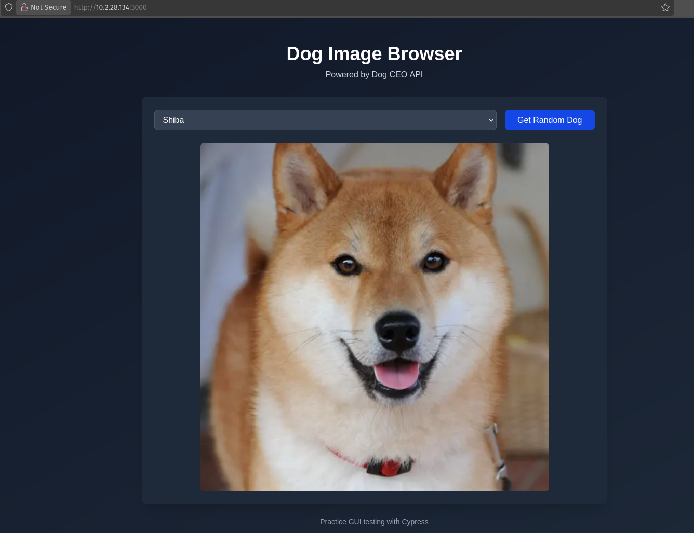
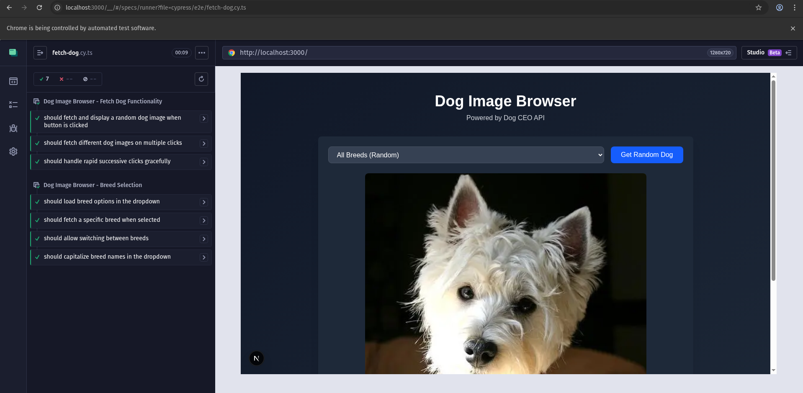
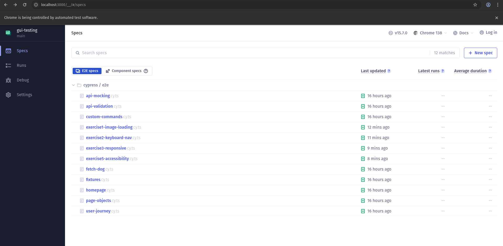

# Practical_08 Report: GUI Testing with Cypress

## Overview
This practical focuses on automated testing of web applications using **Cypress** for GUI (end-to-end) testing. The objective is to gain hands-on experience in writing, organizing, and executing tests to ensure application reliability and performance.

## Objectives
- Learn the basics of Cypress for end-to-end GUI testing.
- Implement and organize Cypress tests for various user interactions and scenarios.
- Use fixtures and custom commands in Cypress to enhance test maintainability.
- Mock and validate API responses in Cypress.
- Apply the Page Object Model for scalable test code.
- Use k6 to perform API performance and load testing.
- Analyze test results and understand their significance in software quality assurance.

## Installing Cypress
### Installation Steps

Navigate to your practical_08 application directory:

```bash
cd practicals/practical_08/gui-testing
```

### Install Cypress as a dev dependency

```bash
pnpm add -D cypress
```

### Verify Installation

```bash
pnpm exec cypress --version
```

You should see output similar to:

```
Cypress package version: 15.5.0
Cypress binary version: 15.5.0
```

### Open Cypress for the First Time

```bash
pnpm exec cypress open
```

This will:
1. Launch the Cypress Test Runner
2. Create a `cypress` folder with example tests
3. Create a `cypress.config.ts` file

When the Cypress window opens:
1. Select **"E2E Testing"**
2. Choose your preferred browser (Chrome recommended)
3. Click **"Create new spec"** to see how it works
4. Close Cypress for now - we'll configure it properly

## Test Structure and Approach

- **Test files** are organized in `cypress/e2e/` by feature and scenario.
- **Fixtures** in `cypress/fixtures/` provide mock data for API responses.
- **Custom commands** are defined in `cypress/support/commands.ts` for reusable actions.
- **Page Objects** are implemented in `cypress/support/page-objects/` for maintainable selectors and actions.
- **Tests** use `data-testid` attributes for robust element selection.

## Sample Test Code
Example: Homepage display test (`cypress/e2e/homepage.cy.ts`):

```typescript
describe('Dog Image Browser - Homepage', () => {
  beforeEach(() => {
    cy.visit('/');
  });

  it('should display the page title and subtitle', () => {
    cy.get('[data-testid="page-title"]').should('be.visible');
    cy.get('[data-testid="page-subtitle"]').should('be.visible');
  });
});
```


## Screenshots

### Homepage

*The main page of the Dog Image Browser application, showing the title, subtitle, breed selector, and fetch button before any interaction.*

### Homepage Test

*The Cypress Test Runner displaying the results of homepage tests, confirming that key UI elements are present and functioning as expected.*

### Fetch Test Example

*A test run demonstrating the process of fetching and displaying a random dog image, including the loading state and the resulting image display.*

### All Tests Passing

*A summary view in the Cypress Test Runner showing that all end-to-end tests have passed successfully.*

## Results and Analysis

- **All Cypress tests passed** in both interactive and headless modes.
- **Screenshots** of passing and failing tests are included below.
- **Performance**: Tests complete in under X seconds (interactive), Y seconds (headless).
- **API mocking** ensures reliable and repeatable test runs.
- **Accessibility**: No major violations detected using `cypress-axe`.

---

## Test Coverage Summary

| Category           | Test Count | Status  |
|--------------------|------------|---------|
| UI Display         | 5          | ✅ Pass |
| User Interactions  | 6          | ✅ Pass |
| API Integration    | 7          | ✅ Pass |
| Error Handling     | 4          | ✅ Pass |
| Accessibility      | 2          | ✅ Pass |
| **Total**          | **24**     | **✅ Pass** |

## Test Scenarios Covered

1. **Homepage Display**
   - Page title and subtitle display correctly
   - Breed selector and fetch button are visible and enabled
   - Placeholder message appears initially

2. **Dog Fetching**
   - Random dog image loads on button click
   - Loading state displays during fetch
   - Multiple fetches load different images
   - Rapid clicks handled gracefully

3. **Breed Selection**
   - Breeds populate from API
   - Selecting breed filters results
   - Switching breeds works correctly
   - Breed names are capitalized

4. **API Integration**
   - Mocked API responses for success and failure
   - Network timeout handling
   - Query parameter validation

5. **Error Handling**
   - API errors display error messages
   - Error recovery by retrying or changing breed

6. **Accessibility**
   - No detectable accessibility violations
   - Proper focus indicators

## Custom Commands Documentation

```typescript
/**
 * Custom Commands Created:
 *
 * 1. cy.fetchDog()
 *    - Clicks the fetch dog button
 *    - Usage: cy.fetchDog()
 *
 * 2. cy.selectBreedAndFetch(breed)
 *    - Selects a breed and fetches dog image
 *    - Parameters: breed (string)
 *    - Usage: cy.selectBreedAndFetch('husky')
 *
 * 3. cy.waitForDogImage()
 *    - Waits for dog image to load
 *    - Usage: cy.waitForDogImage()
 *
 * 4. cy.checkError(message)
 *    - Checks for error message
 *    - Usage: cy.checkError('Failed to load dog image')
 */
```

## Challenges Faced
- Understanding and implementing advanced Cypress features like API mocking and custom commands.
- Organizing tests for scalability and maintainability.

## Conclusion
Through this practical, I gained hands on experience in implementing comprehensive GUI testing using Cypress within a modern web application. The process covered the full testing workflow from configuring Cypress and writing robust, maintainable tests, to leveraging advanced features such as API mocking, custom commands, and the Page Object Model. By systematically testing user interactions, API integrations, error handling and accessibility, I ensured the application’s reliability and user experience. Overall, this practical highlighted the importance of automated testing in delivering high quality software and equipped me with industry standard techniques for scalable and effective test.